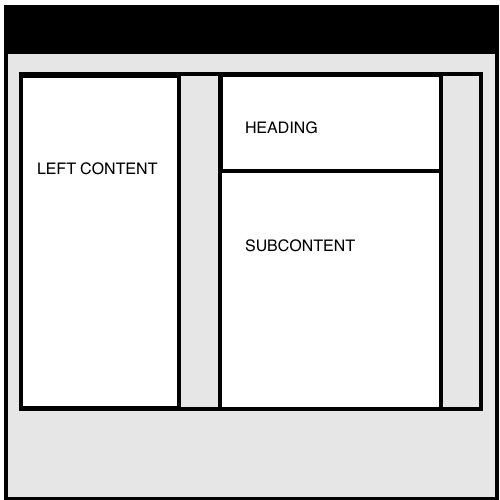
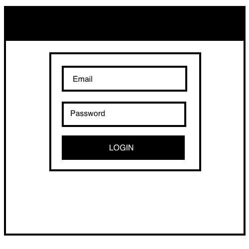
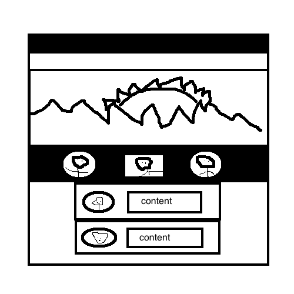
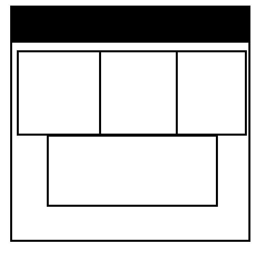

## Templating with Bootstrap

The UI designer at your dev shop, Site.ly, has just handed you four layouts depicting the new site in development for the client.

The UI team requests that you use [Bootstrap](http://getbootstrap.com/) to implement them. Feel free to put in placeholder images and text for now. They suggest [placekittens](http://www.placekittens.com) and [Hipster Ipsum](http://hipsum.co/) as great resources.

[Boostrap Grid](http://getbootstrap.com/css/#grid)

###Content Feed

###Login form

###Home Page w/ Hero Img

###Arranged Text Boxes

